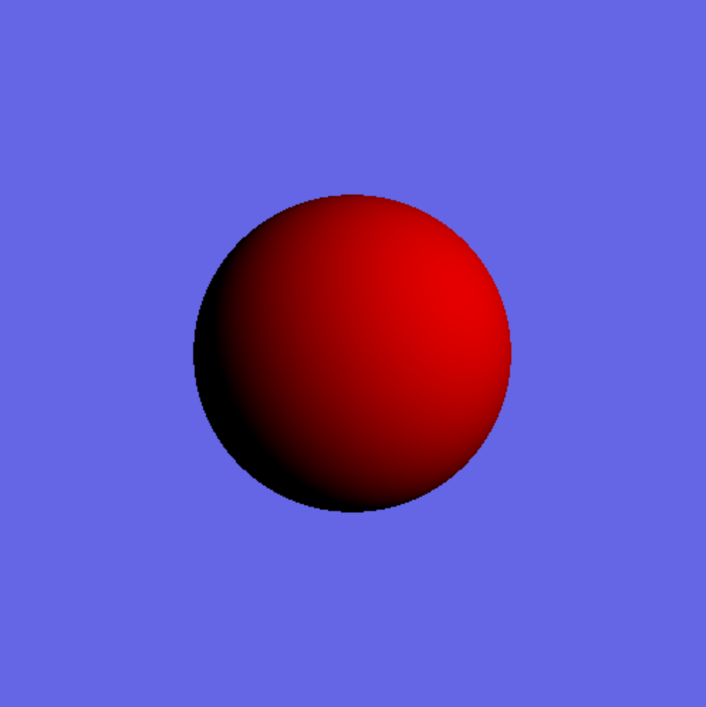
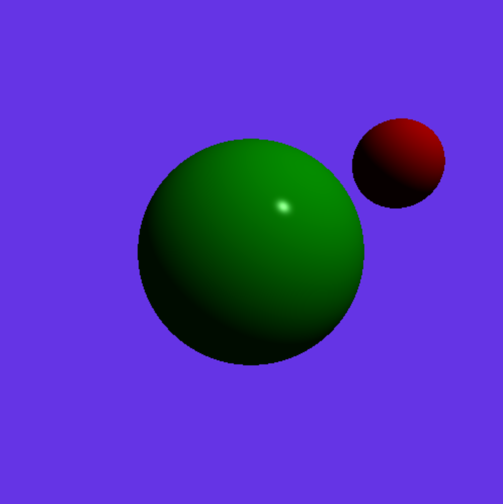
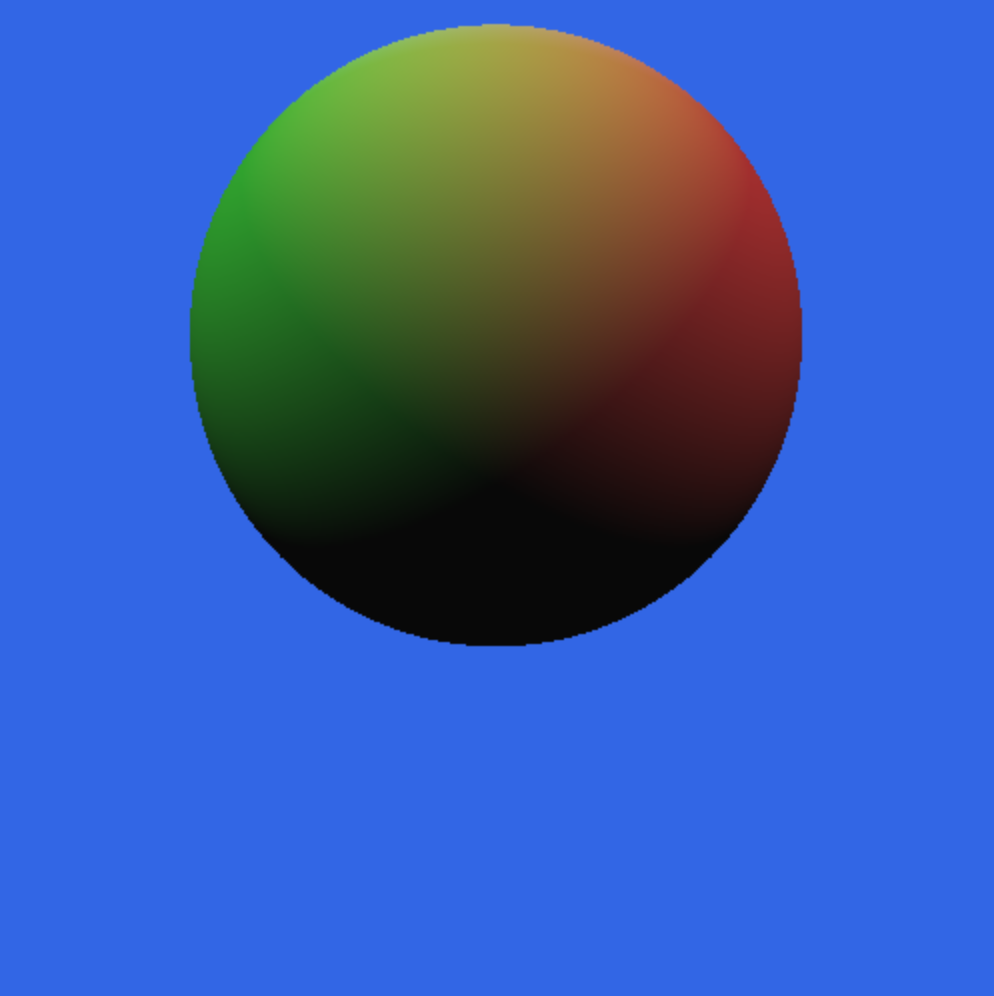
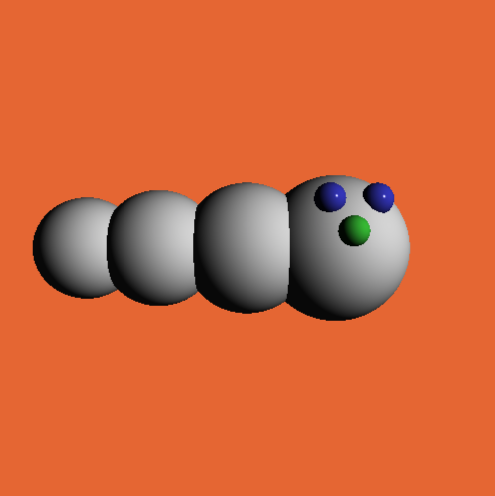
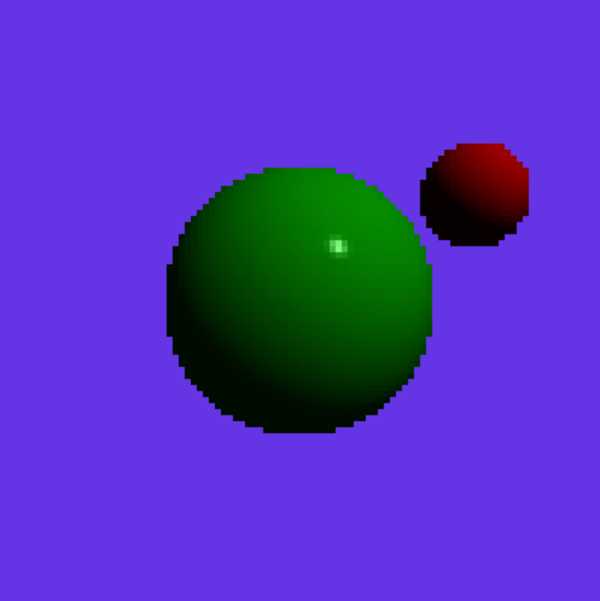
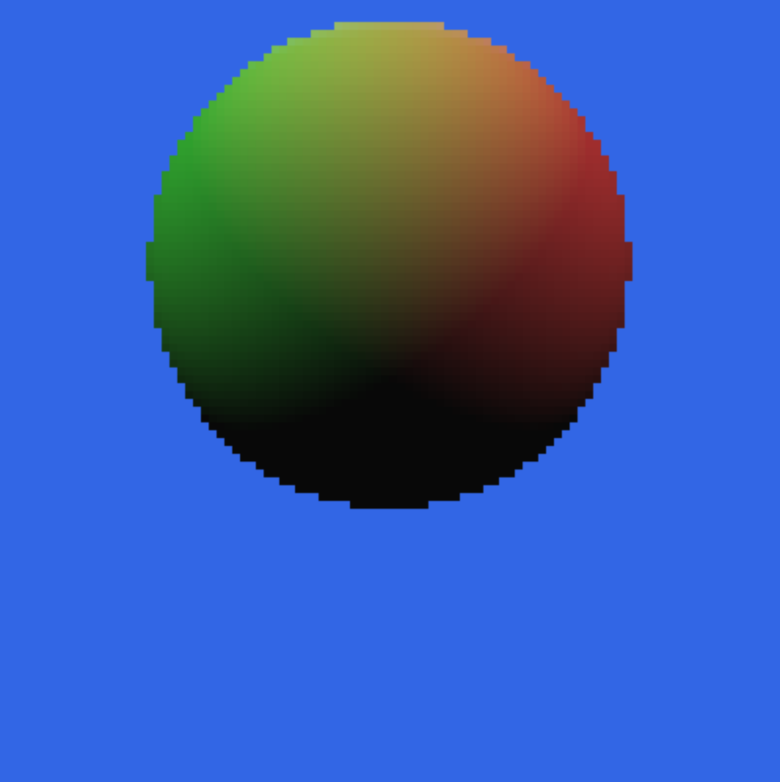
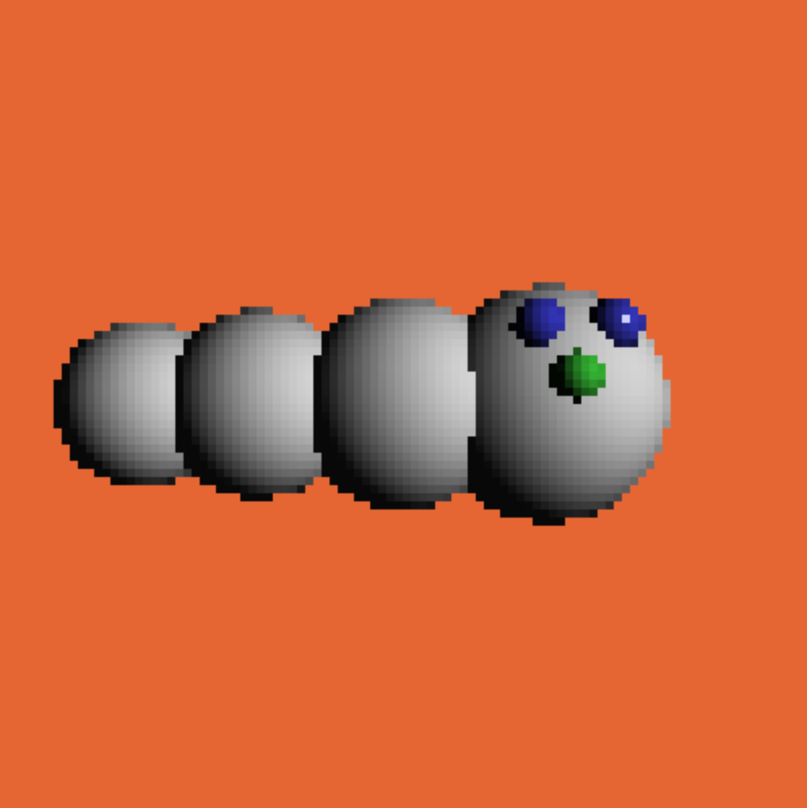

# Assignment 3a:  Ray Tracing Spheres

The goal of this project is to write a ray tracing renderer. You will write a collection of Javascript functions that, when called, will create a 3D scene and produce 2D images of the scene. One of the functions will initialize the scene, others will create objects, lights and a virtual camera, and one additional function will determine the color of a ray cast into the scene, that will be used to render the scene into a 2D image. You will be provided with various scenes that will call your functions to test your ray tracing code.

This is the first half of a two-part project. For this first part you will cast eye rays into the scene for each pixel, test these rays for intersection with sphere objects, and then use the the Lambertian shading equation (ambient + diffuse + specular) to find the color for each pixel. In the second half of the project you will expand your Ray Tracer to detect intersections between rays and disks. You will also expand your shading function to cast shadows, reflected rays, support area lights, and implement distribution raytracing. Keep this in mind when deciding on implementation details.

## Due: Tuesday November 2nd, 11:59pm

## Rubric

Graded out of 10.

1. (2 points) Enough of `eyeRay(i,j)` that scene 0 (empty scene) works. Should use the values defined in `set_fov()` and `set_eye()` (TA may look at code to see if it's plausibly correct)
2. (1 point) `reset_scene()` empties the scene,  including resetting background and ambient light. `ambient_light` and `set_background()` set values to be used by ray color calculation.
3. (1 point) create scene data structure. `new_light()`, `new_sphere()`.
4. (2 point) `traceRay()` finds the closest point on one of the spheres and calls some method to compute the color for it.
5. (1 point) color for ray includes correct ambient contribution
6. (3 point) color for ray includes the correct diffuse (1 point) and specular (1 point) contribution per light (1 point for all lights).

## Project Description

You have four primary goals for the first part of this project:

1. Initialize the scene 
2. Cast eye rays for each pixel
3. Implement detection of ray intersection with spheres
4. Implement the shading equation

You can accomplish these goals however you see fit. A good approach would be to use object oriented programming practices and create objects for each of the major scene components (light, ray, sphere, and later disks). Global lists of scene objects can be stored to allow for easy access. You can then create a Ray object for each pixel and write a method which will take a Ray as input and test it against the scene objects for intersections, returning the closest hit. This Hit object, containing all necessary information, can then be passed to a shading function which would implement the shading equation (for multiple light sources) and return the pixel color. Such an approach would be easy to test and to extend in the next stage of the project.

However you implement the ray tracer, your results should appear exactly like the examples shown below in Results.

# Provided Code

The provided source code in `testRayTracer.ts` is structured similarly to the `app.ts` A1 sample code, creating a canvas in its constructor, setting up a `RayTracer` object defined in `rayTracer.ts`, and having routines to create various scenes using the functions you will write. Each number key 1-4 is assigned to a single scene function and pressing that key should reset the scene and create an image of the new one. 

The code in `rayTracer.ts` contains some code to get your started, along with empty functions used for scene setup. These are described below. You will need to implement them.  Feel free to define any classes, objects, data structures, and global variables that you want to accomplish this project.  (We also recommend breaking complex equations down into simple equations assigned to extra variables; aside from making the code clearer, having these values in separate variables makes debugging easier because you can look at them in the debugger.)

You should modify the source code in any way you see fit, and comment your code (include placing your name in the header). The source code is written in Typescript. You are NOT allowed to use any graphics commands from libraries such as Three.js or native web libraries, all code must be your own. We are not using rasterization for this project, so you should not need any of these libraries.

We have provided sample Vector and Color data types, which you can use as is, or modify as desired. And you may use the standard Javascript/Typescript math functions.  When in doubt about what library functions are okay to use, please ask the instructor or a TA.

We have provided a `draw_scene()` function that loops through the pixels and calls `traceRay(ray)` and `eyeRay(i,j)` you will write. `draw_scene()` draws the pixels into a canvas for you.

# Scene Description Language

Each scene is described by calling several methods on the RayTracer object that set up and render the scene.  

Below are the methods that you will need to implement for this assignment:

#### `reset_scene ()`

Initialize all the data structures and variables so you can start with an empty scene.

#### `set_background (r, g, b)`

Sets the background color. If a ray misses all the objects in the scene, the pixel should be given this color.

#### `set_fov (angle)`

Specifies the field of view (in degrees) for perspective projection. Default value 90. You will need to convert this to the focal length d.  You will then use this together with the eye position and the u, v, and w vectors of the eye's rotation matrix to create the eye rays.

#### `set_eye (cx, cy, cz, lx, ly, lz,  ux, uy, uz)`

Specifies the eye position (cx,cy,cz) in 3D coordinates along with a lookat point (lx,ly,lz) that define the position and direction the camera is looking. An up vector (ux, uy, uz) allows you to set the full orientation of the camera.  Camera is at the origin, looking down the -z axis by default.

#### `new_light (r, g, b, x, y, z)`

Create a point light source at position (x,y,z) and its color (r, g, b). Your code should allow at least 10 light sources. For the second part of this assignment, you will cause these lights to cast shadows.

#### `ambient_light (r, g, b)`

Create an "ambient" light with color (r, g, b), in order to approximate indirect illumination. There is only one ambient light; multiple calls will just replace the ambient light.

#### `new_sphere  (x, y, z, radius, dr, dg, db, k_ambient, k_specular, specular_power)`

Specifies the creation of a sphere with its center at (x, y, z) and with a given radius.  The diffuse color of the sphere is given by (dr, dg, db).  The coefficient k_ambient specifies how much of the ambient light combines with the diffuse color of the surface.  For this project, we will assume that all specular highlights are white, and the brightness of the highlight is given by k_specular. The tightness of the highlight is guided by specular_power. 

#### `draw_scene()`

Ray-traces the scene and displays the image in the canvas region in your browser.  We have provided this method, but you will need to implement two internal methods, `traceRay(ray)` and `eyeRay(i,j)`, that this method calls.

Note on color specification: Each of the red, green, and blue components for the above commands are floating point values in the range of 0.0 to 1.0.

# Results

Below are the images that your program should generate for the sample scenes, when you press the keys 1-4. Key 0 will draw an empty scene with just the background color. No scene is generated when the program starts, you will just see a light yellow canvas. There will be additional scene descriptions provided for Part B of this project.







The canvas is a fixed size (the number of pixels in the canvas), specified in the RayTracer object constructor. The constructor also allows you to set the number of virtual pixels that will be ray traced; these should be smaller than the number of pixels in the canvas (ideally simple fractions of them). It will draw larger "pixels" in the canvas so it is filled.  Using smaller numbers of virtual pixels will make debugging faster. 

The sample project is set up with a 500x500 pixel canvas, but only renders 100x100 virtual pixels, resulting in 5x5 canvas pixels for each virtual ray-traced pixel.  The sample scenes will look like this with these settings.






# Authorship Rules

The code that you turn in should be entirely your own. You are allowed to talk to other members of the class and to the instructor and the TA’s about general implementation of the assignment. It is also fine to seek the help of others for general Typescript and Web programming questions. You may not, however, use code that anyone other than yourself has written. The only exceptions are that you should use the source code that we provide for this project. Code that is explicitly not allowed includes code taken from the Web, github, from books, from other students, or from any source other than yourself. You should not show your code to other students. Feel free to seek the help of the instructor and the TA's for suggestions about debugging your code.

# Submission

You will check out the project from GitHub Classroom, and submit it there.  

**Do Not Change the names** of the existing files (e.g., index.html, rayTracer.ts, etc).  The TAs need to be able to test your program as follows:

1. cd into the directory and run ```npm install```
2. run with ```npm run dev```
3. visit ```http://localhost:3000/index.html```

Please test that your submission meets these requirements.  For example, after you check in your final version of the assignment to github, check it out again to a new directory and make sure everything builds and runs correctly.
 
## Development Environment

The development environment is the same as used in previous assignments.

## License

<a rel="license" href="http://creativecommons.org/licenses/by-nc-sa/4.0/"></a><br /><span xmlns:dct="http://purl.org/dc/terms/" property="dct:title">Computer Graphics CS3451 Fall 2021</span> by <a xmlns:cc="http://creativecommons.org/ns#" href="https://github.blairmacintyre.me" property="cc:attributionName" rel="cc:attributionURL">Blair MacIntyre</a> is licensed under a <a rel="license" href="http://creativecommons.org/licenses/by-nc-sa/4.0/">Creative Commons Attribution-NonCommercial-ShareAlike 4.0 International License</a>.

The intent of choosing (CC BY-NC-SA 4.0) is to allow individuals and instructors at non-profit entities to use this content.  This includes not-for-profit schools (K-12 and post-secondary). For-profit entities (or people creating courses for those sites) may not use this content without permission (this includes, but is not limited to, for-profit schools and universities and commercial education sites such as Corsera, Udacity, LinkedIn Learning, and other similar sites).
